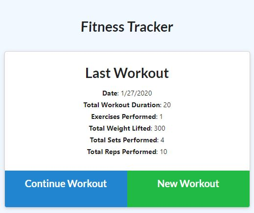
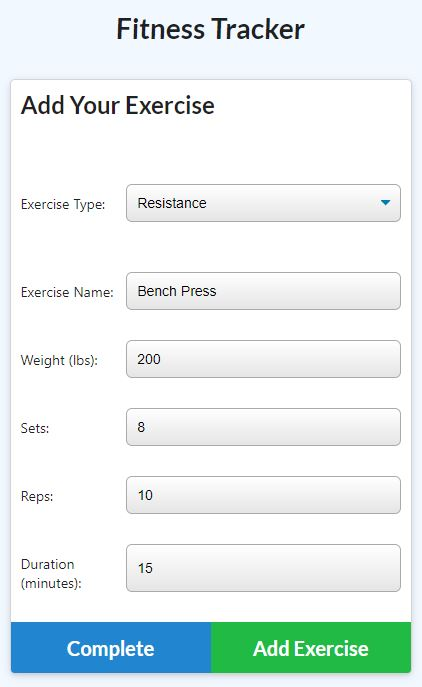
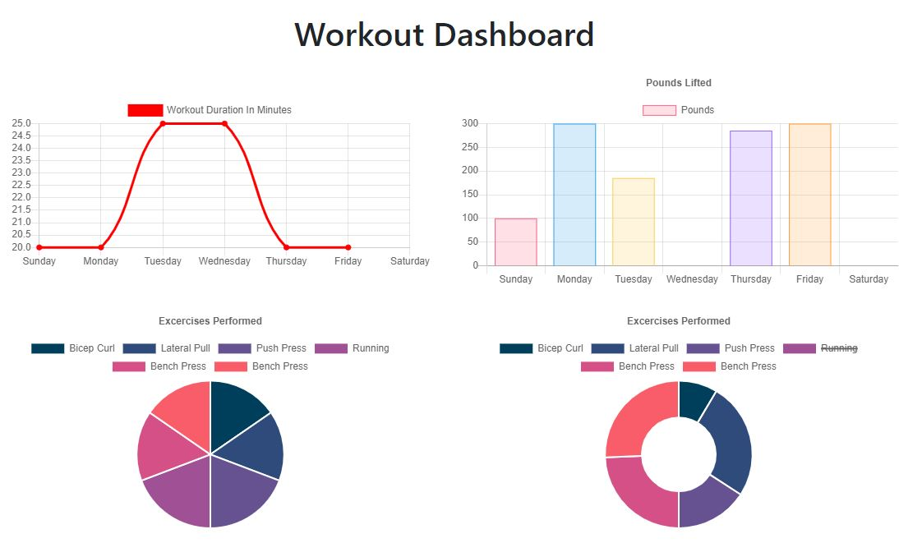

#Workout Tracker
Unit 17 Nosql Homework: 
 

## Application Overview

This fitness tracker built using NodeJS Express, Mongoose, and MongoDB. 

##Application Functionality

Users can create a new workout routine, which is saved to the database or users can continue an existing workout routine. 

Users can also see past workouts on a chart to see how they did over the week on the dashboard
